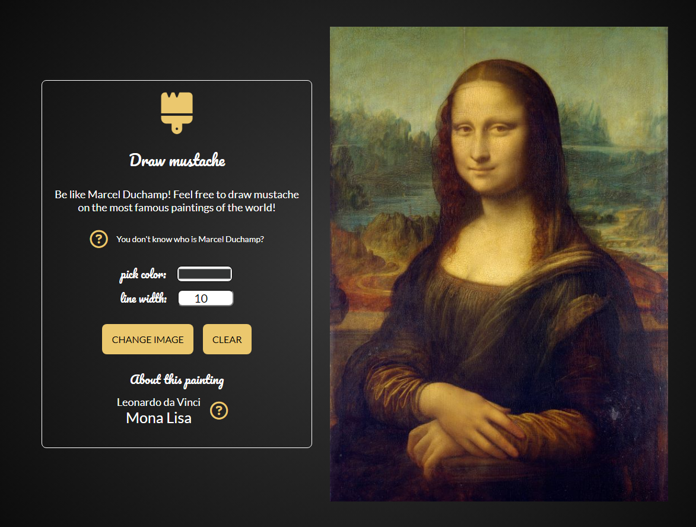
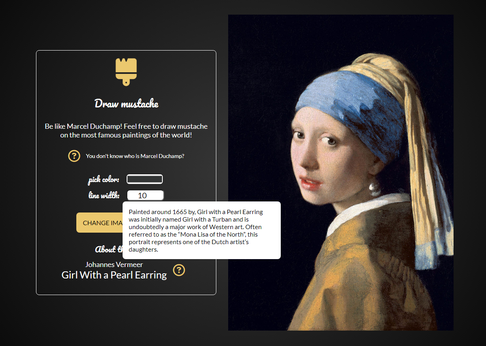

 # Draw Mustache 

> Java Script application to have fun and learning art history. Inspirated by french artist Marcel Duchamp, who created "L.H.O.O.Q." based on a cheap postcard reproduction of Leonardo da Vinci's "Mona Lisa" onto which Duchamp drew a mustache and beard in pencil and appended the title.  

> Live demo [_here_](https://abarnowska.github.io/DrawMustache/).

## Table of Contents
* [General Info](#general-information)
* [Technologies Used](#technologies-used)
* [Screenshots](#screenshots)
* [Contact](#contact)

## General Information
- I've made this project to improve my JavaScript skills.
- I love the history of art and programming, and this project gave me the opportunity to connect these two things.

## Technologies Used
- HTML5
- HTML Canvas 
- CSS3
- Java Script

## Screenshots

## Contact
Created by Angelika Barnowska-Nawara. Feel free to contact me! (angelika.barnowska@gmail.com)
